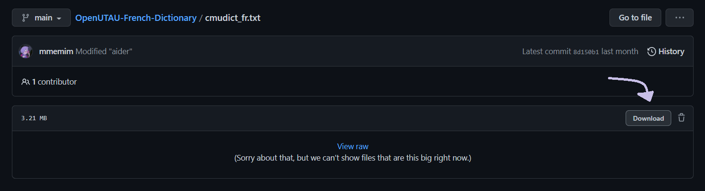
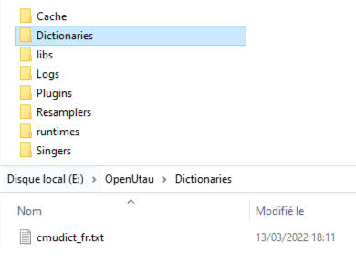
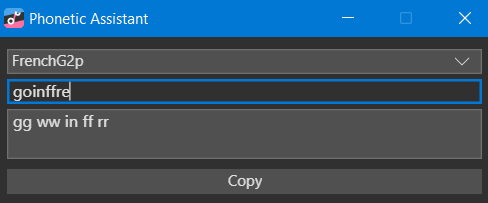

# OpenUTAU-French-Dictionary
French Dictionary for [OpenUTAU](https://www.openutau.com/), based on the [French CMU Pronouncing Dictionary](https://sourceforge.net/projects/cmusphinx/files/Acoustic%20and%20Language%20Models/French/), modified for easier ease in OpenUTAU.

This dictionary is meant to be used with French CVVC Phonemizer, compatible with Petit Mot, Gros Mot & Fraloids voicebanks & the French VCCV Phonemizer, compatible with m2RUg. 

You can learn more about French UTAUs on [frenchutauhelp.carrd.co](https://frenchutauhelp.carrd.co/) & [utaufrance.com](https://utaufrance.com/).

If there's any issue, you can contact me through my [Twitter](https://twitter.com/mmem1m).

✨ Feel free to contribute ✨

### See also

* [Google Drive mirror for this dictionary download](https://drive.google.com/file/d/1m-wnt5reJ0d9rGC2e1jMlZUMeioA5Lnw/view)
* [French UTAUs voicebanks and tutorials -> utaufrance.com](https://utaufrance.com/) 

## Download instructions

If you just want to install the dictionary without contributing, you won't need a Github account or to understand how to use Git.
Just follow the two steps below : 

-  First, download the [cmudict_fr.txt](https://github.com/mmemim/OpenUTAU-French-Dictionary/blob/main/cmudict_fr.txt) file by clicking on the filename
and then click on the download icon in the upper left corner of the file browser, as shown in the image below.

-  Then drag and drop the file inside your OpenUtau `Dictionaries` folder. If the folder doesn't exist, create one at the root of your OpenUtau folder.

## How to add a word

Please follow the alphabetical order when adding a new word inside the `cmudict_fr.txt` file.

* Write your word first, then add **two** blanks space before the first phoneme of the pronunciation.
* Each phoneme in the pronunciation is separated by a single blank space.
* Be careful not to accidentally add another blank space at the very end of the line, but just a line break.
* After saving the file, you can close and re-open OpenUtau to force the dictionary to reload.
* You can add additional prononciations with (2), (3) etc.

For example, if you wanted to add `parfaitement` you'd add:

`parfaitement  pp aa rr ff ai tt ee mm an` basic form

`parfaitement(2)  pp aa rr ff ai tt ee mm an tt` basic form with liaison

`parfaitement(3)  pp aa rr ff ai tt mm an` shortened form

`parfaitement(4)  pp aa rr ff ai tt mm an tt` shortened form with liaison

If you're not sure about how to write the prononciation, you can use the phonetic assistant in FrenchG2P as shown in the picture below.
You will find it in OpenUtau under the "Tools" tab.

Here is a chart of the arpabet phonetics compared to other common phonetics system:

| Arpabet  | Mot | m2RUg |
| ------------- | ------------- | ------------- |
| aa  | ah  | A  |
| ai  | ae  | E  |
| ei  | eh  | e  |
| ee/eu | ee  | 2  |
| oe | oe  | 9  |
| ii | ih  | i  |
| au | oh  | o  |
| oo | oo  | O  |
| ou | ou  | u  |
| uu | uh  | y  |
| an | en  | a  |
| in/un | in  | U  |
| on | on  | 0  |
| yy  | y  | j  |
| ww  | w  | w  |
| uy  | ui  | H  |
| bb | b  | b  |
| dd | d  | d  |
| ff | f  | f  |
| gg | g  | g  |
| kk | k  | k  |
| ll | l  | l  |
| mm | m  | m  |
| nn | n  | n  |
| gn | ny  | J  |
| pp | p  | p  |
| rr | r  | R  |
| ss | s  | s  |
| ch | sh  | S  |
| tt | t  | t  |
| vv | v  | v  |
| zz | z  | z  |
| jj | j  | Z  |
| ww aa | oi  | wA  |
